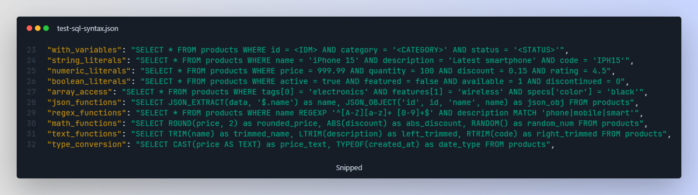
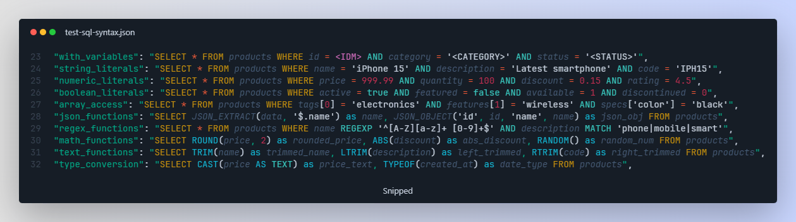

<div align="center">
  
  
  # SQL Highlighter For JSON

  A VS Code extension that enhances the developer experience when working with SQL queries embedded in JSON strings. Features automatic syntax highlighting for SQL within JSON files and a dedicated SQL editor with auto-complete, formatting, and seamless conversion back to single-line strings suitable for JSON.
</div>

## 🎯 Perfect For

- Configuration files containing SQL queries
- Database migration scripts in JSON format
- Any JSON file where SQL queries are stored as string values
- Editing and formatting complex SQL queries embedded in JSON strings

## 🎨 Visual Highlighting

The extension provides distinct visual cues for different elements:

**Before:** Plain JSON with unreadable SQL strings
  

**After:** Beautiful syntax highlighting with proper SQL colors
  

- **SQL Keywords**: `SELECT`, `FROM`, `WHERE`, `JOIN`, `GROUP BY`, etc. - Your theme's keyword color
- **SQL Functions**: `COUNT`, `SUM`, `UPPER`, `LOWER`, `REPLACE`, etc. - Your theme's function color
- **SQL Operators**: `AND`, `OR`, `NOT`, `LIKE`, `GLOB`, etc. - Your theme's operator color
- **Single-quoted Strings**: `'DescricaoAplicacao'`, `'0'`, `'?'` - Comment color for easy identification
- **Temporary Variables**: `<IDM>`, `<IDM>` - Purple highlighting to show they're placeholders
- **Comparison Operators**: `=`, `<>`, `<=`, `>=` - Your theme's operator color

## ✨ SQL Editor Feature

Select any SQL text in your JSON file and right-click to open it in a dedicated SQL editor:

  

### 🚀 How to Use
1. **Select SQL text** in your JSON file (the string containing SQL)
2. **Right-click** and choose "Edit in SQL Editor"
3. **Edit with full SQL support** including syntax highlighting and autocomplete
4. **Save or Cancel**:
   - **Save**: Converts back to a clean JSON string (removes line breaks and extra spaces)
   - **Cancel**: Discards changes and closes the editor

### 🎯 Best Use Cases
- **Complex SQL queries** that are hard to read in JSON strings
- **Multi-line SQL** that needs proper formatting and editing
- **Quick SQL editing** without leaving VS Code

## 📦 Installation

Download the `.vsix` file from the latest release and install it in VS Code:
1. Open VS Code
2. Go to Extensions (Ctrl+Shift+X)
3. Click the "..." menu and select "Install from VSIX..."
4. Select the downloaded `.vsix` file

## 🎮 Usage

### Automatic Detection
The extension automatically detects JSON files containing SQL and switches to SQL highlighting mode.

### Manual SQL Editing
1. Open a JSON file with embedded SQL
2. Select the SQL string you want to edit
3. Right-click and choose "Edit in SQL Editor"
4. Edit your SQL with full syntax highlighting and auto-complete
5. Click "Save" to update the JSON string or "Cancel" to discard changes

## 🔧 Development

To build the extension:

```bash
npm install
npm run compile && npx vsce package
```

To watch for changes during development:

```bash
npm run watch
```

## 🤖 Automated Releases

This project uses GitHub Actions for automated releases. When you push a tagged commit, the workflow will automatically:

1. Compile the TypeScript code
2. Package the extension into a `.vsix` file
3. Create a GitHub release with the packaged extension

### Creating a Release

1. Update the version in `package.json`
2. Commit your changes
3. Create and push a tag:

```bash
git tag v1.0.3
git push origin v1.0.3
```

The workflow will automatically trigger and create a release with the packaged extension attached.

## 📄 License

MIT License
