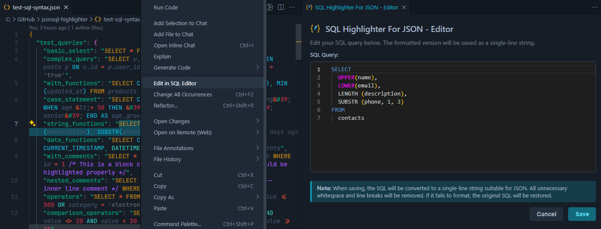

# SQLite Highlighter for JSON

A VS Code extension that provides SQLite syntax highlighting for SQL queries embedded in JSON files.



## 🎯 Perfect For

- Configuration files containing SQL queries
- Database migration scripts in JSON format
- Any JSON file where SQLite queries are stored as string values

## 🎨 Visual Highlighting

The extension provides distinct visual cues for different elements:

- **SQL Keywords**: `SELECT`, `FROM`, `WHERE`, `JOIN`, `GROUP BY`, etc. - Your theme's keyword color
- **SQL Functions**: `COUNT`, `SUM`, `UPPER`, `LOWER`, `REPLACE`, etc. - Your theme's function color
- **SQL Operators**: `AND`, `OR`, `NOT`, `LIKE`, `GLOB`, etc. - Your theme's operator color
- **Single-quoted Strings**: `'DescricaoAplicacao'`, `'0'`, `'?'` - Comment color for easy identification
- **Temporary Variables**: `<IDM>`, `<IDM>` - Purple highlighting to show they're placeholders
- **Comparison Operators**: `=`, `<>`, `<=`, `>=` - Your theme's operator color

## 📦 Installation

1. Install the VSIX package in VS Code
   
   
3. Open any JSON file with SQLite queries
4. Enjoy enhanced syntax highlighting!

## 🔧 Development

To build the extension:

```bash
npm install
npm run compile && npx vsce package
```

To watch for changes during development:

```bash
npm run watch
```

## 🤖 Automated Releases

This project uses GitHub Actions for automated releases. When you push a tagged commit, the workflow will automatically:

1. Compile the TypeScript code
2. Package the extension into a `.vsix` file
3. Create a GitHub release with the packaged extension

### Creating a Release

1. Update the version in `package.json`
2. Commit your changes
3. Create and push a tag:

```bash
git tag v1.0.3
git push origin v1.0.3
```

The workflow will automatically trigger and create a release with the packaged extension attached.

## 📄 License

MIT License
