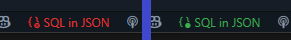
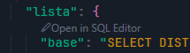

<div align="center">
  
  
  # SQL Highlighter For JSON

  A VS Code extension that enhances the developer experience when working with SQL queries embedded in JSON strings. Features automatic syntax highlighting for SQL within JSON files and a dedicated SQL editor with auto-complete, formatting, and seamless conversion back to single-line strings suitable for JSON.
</div>

## 🎯 Perfect For

- **Configuration files** with embedded SQL queries that need proper syntax highlighting
- **Database migration scripts** stored in JSON format with complex SQL statements  
- **API responses** containing SQL queries that require editing and formatting
- **Development workflows** where SQL is stored as JSON strings in configuration
- **Code reviews** of JSON files with embedded SQL - much easier to read and understand

## 🟢/🔴 Toggle SQL-in-JSON Mode

Enable or disable highlighting & CodeLens via the status-bar toggle:

  

Click the toggle to switch between:

* 🟢 **ON** – JSON strings containing SQL are highlighted and CodeLens appears.
* 🔴 **OFF** – File behaves like normal JSON.

## 🎨 Visual Highlighting

The extension provides distinct visual cues for different elements based on your VS Code theme colors:

**Before:** Plain JSON with unreadable SQL strings
  

**After:** Beautiful syntax highlighting with proper SQL colors
  

## ✨ SQL Editor Feature

Open the SQL editor in two ways:

1. **Click** the CodeLens button shown above SQL strings

  

2. **Select** a SQL string in your JSON, **Right-click** and choose **Edit in SQL Editor**

  

### 🚀 How to Use
1. **Open** the SQL Editor from the **CodeLens button**, or context menu by **Selecting a String > Right-clicking > Edit in SQL Editor**
2. **Edit with full SQL support** including syntax highlighting and autocomplete
43. **Save or Cancel**:
   - **Save**: Converts back to a clean JSON string (removes line breaks and extra spaces)
   - **Cancel**: Discards changes and closes the editor

## 📦 Installation

Download the `.vsix` file from the latest release and install it in VS Code:
1. Open VS Code
2. Go to Extensions (Ctrl+Shift+X)
3. Click the "..." menu and select "Install from VSIX..."
4. Select the downloaded `.vsix` file

## 🔧 Development

To build the extension:

```bash
npm install
npm run compile && npx vsce package
```

To watch for changes during development:

```bash
npm run watch
```

## 🤖 Automated Releases

This project uses GitHub Actions for automated releases. When you push a tagged commit, the workflow will automatically:

1. Compile the TypeScript code
2. Package the extension into a `.vsix` file
3. Create a GitHub release with the packaged extension

### Creating a Release

1. Update the version in `package.json`
2. Commit your changes
3. Create and push a tag:

```bash
git tag v1.0.3
git push origin v1.0.3
```

The workflow will automatically trigger and create a release with the packaged extension attached.

## 📄 License

MIT License
